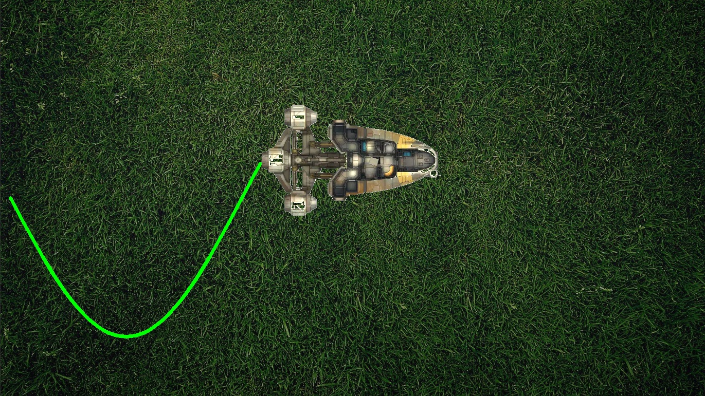

# OpenCV basics

> This is the first laboratory work using OpenCV.

---

### Table of contents

- [Task](#Task)
- [Features of the work](#Features of the work)
- [Work results](#Work results)

---

### Task

- I have the <ins>**twenty-first variant**</ins>, so I used sin function for the robot movement.
- **The app displays an animation of the robot movement**. I call the robot a drone.
- **The app also displays the trajectory** of the robot.
- The background and the robot are loaded from the paths `sources/background` and `sources/robot` respectively.
- A screenshot is taken in the middle of the robot's path. It is saved using the next path `sources/workResult`.

---

### Features of the work

1. I wrote a certain filter to paste only the drone (without its background).
2. The system is robust. The amplitude of the sine, its beginning and end vary depending on the size of the background and the robot.
3. You can use the constants to change sine frequency, etc.
4. The program takes a screenshot when the drone in the middle of his way.

---

### Work results

#### Start screen 

#### Middle of the way

#### App work result

#### Video of the app work (`SIN_WAVE_FREQUENCY_INCREASER` is 2)

#### Video of the app work (`SIN_WAVE_FREQUENCY_INCREASER` is 8)
